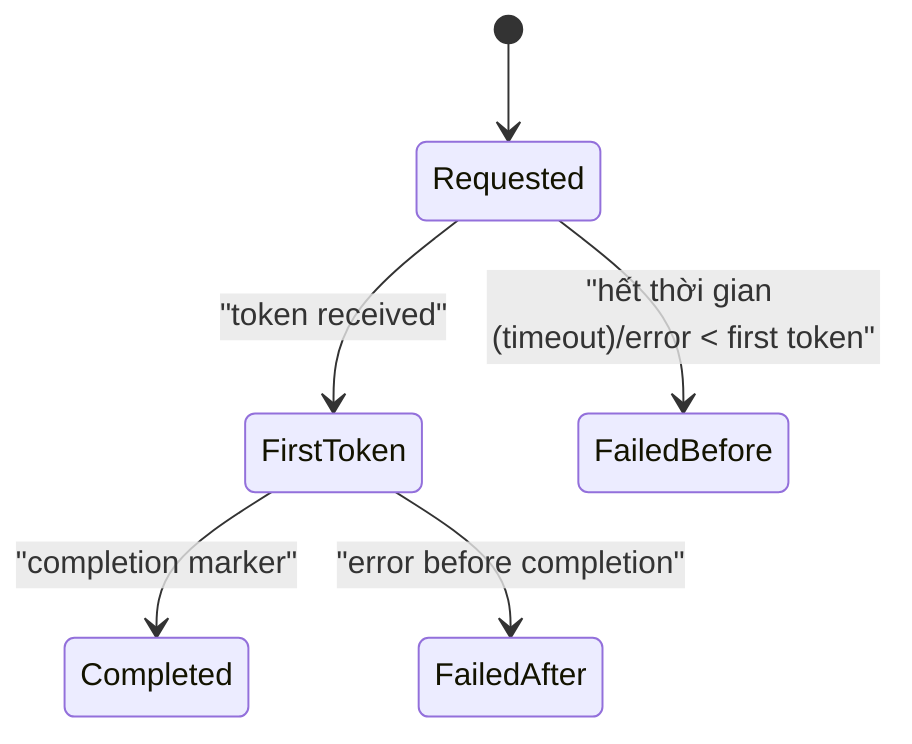

# TarotWeb - Kiến trúc kỹ thuật (Tech Architecture) v1.5

Nguồn: tách từ `FEATURE_REQUIREMENTS_BLUEPRINT_v1.5.md` (2026-03-06).
Mục tiêu: tập trung vào kiến trúc hệ thống, mô hình dữ liệu/trạng thái (data/state models), tích hợp (integration) và ràng buộc triển khai (implementation constraints).

Tiền tố ID tài liệu (Doc ID prefix): `ARCH-*`

---

## 1) Cơ sở kiến trúc (Architecture baseline)

### 1.1 Ngăn xếp công nghệ chi tiết (Technology stack)

| Nhóm | Công nghệ chốt | Plugin/Thư viện chính | Phần nghiệp vụ phục vụ | Quy ước triển khai |
|---|---|---|---|---|
| Khung web (Web framework) | Next.js (App Router) + React + TypeScript | `next/image`, `next/font`, `next/script` | Trang public SEO + khu vực app chính | Server components cho nội dung đọc nhiều, client components cho tương tác nặng |
| Rendering/SEO | SSR + SSG + ISR theo route | `next-sitemap`, `schema-dts` | Landing, reader hồ sơ (profile) public, nội dung index Google | Route riêng tư không index, route public có siêu dữ liệu (metadata) chuẩn |
| UI system | Tailwind CSS + Radix UI + shadcn/ui | utility libs theo convention team (optional) | Component tái sử dụng và responsive | Dùng chung design tokens giữa web và mobile |
| Animation & FX | Framer Motion | `react-use-measure`, `canvas-confetti` (scene đặc biệt) | Tráo/lật bài, reveal kết quả, hiệu ứng progression | Có cấu hình hiệu ứng theo năng lực thiết bị |
| trạng thái phía máy chủ (State server) | TanStack Query | `axios` | Cache API, invalidate, retry | Query key theo domain để tránh cache collision |
| trạng thái phía máy khách (State client) | Zustand | `immer` | UI state cục bộ: modal, step, draft | Không dùng cho dữ liệu chuẩn hóa từ server |
| biểu mẫu và nhập liệu (Form & input) | React Hook Form + Zod | `@hookform/resolvers` | Xác thực (Auth)/hồ sơ (profile)/payout/admin forms | Validate ở FE và re-validate ở BE |
| i18n | next-intl | ICU message format | VI/EN/ZH cho UI + template nội dung | Chuỗi dự phòng (fallback chain) bắt buộc: locale -> en |
| Realtime client | SignalR + SSE (`EventSource`) | `@microsoft/signalr` | trò chuyện (chat) reader 2 chiều + AI stream 1 chiều | SignalR cho trò chuyện (chat)/event, SSE cho token stream AI |
| API backend | ASP.NET Core 10 Web API | `MediatR`, `FluentValidation`, `ProblemDetails` | Xác thực (Auth)/wallet/reading/trò chuyện (chat)/admin APIs | Chia domain modules rõ ràng để scale team |
| xác thực (Authentication) | JWT + refresh token rotation | Argon2id hasher + ASP.NET Data Protection | Phiên đăng nhập an toàn | Refresh token có revoke và device binding |
| phân quyền (Authorization) | phân quyền dựa trên chính sách (policy-based authorization) | custom requirement handlers | RBAC User/Reader/Admin + ownership | Cấm truy cập chéo tài nguyên của user khác |
| Mô hình ghi PostgreSQL (PostgreSQL write model) | EF Core 10 + Npgsql | `EFCore.NamingConventions` | Wallet/sổ cái (ledger)/escrow/payment/subscription | Mọi thao tác tiền bắt buộc nằm trong transaction |
| Mô hình tài liệu MongoDB (MongoDB document model) | MongoDB.Driver | `MongoDB.Bson` | hội thoại (conversation)/messages/readings/nhật ký/trò chơi hóa (gamification) | ObjectId native, cross-db ref kiểu string |
| Cache | Redis | `StackExchange.Redis` | Cache card catalog/quyền lợi (entitlement)/giới hạn tốc độ (rate-limit) counter | Key namespace + TTL rõ để tránh stale data |
| tác vụ nền (Background jobs) | TickerQ |  | settlement/refund/phát hành/reminder/win-back | Job idempotent + retry giới hạn + dead-letter |
| tích hợp AI (AI integration) | xAI Grok API, chatGPT API | `IHttpClientFactory`, `Polly` | diễn giải AI (AI interpretation) + follow-up suggestion | hết thời gian (timeout) cứng, retry có kiểm soát, ghi nhật ký yêu cầu (request)/response meta |
| Đường ống media (Media pipeline) | AWS S3 + CloudFront | ImageSharp | Asset lá bài, ảnh share, CDN phân phối | DB chỉ giữ URL/phiên bản/checksum |
| thông báo (notifications) | In-app + email (+push mobile) | SES/SendGrid, FCM/APNs | OTP, daily habit, win-back, event chiến dịch | Template đa ngôn ngữ theo locale user, UTF-8 chuẩn hóa; bắt buộc kiểm thử render `zh-Hans`/`zh-Hant` |
| bộ điều hợp thanh toán (Payment adapters) | VietQR/Bank/PayPal adapter layer | webhook signature verifier, idempotency key | Nạp Diamond và đối soát giao dịch | Tách adapter theo nhà cung cấp (provider) để thay thế độc lập |
| Anti-fraud | Rule engine + risk scoring pipeline | Redis counters + background analysis jobs | Chống abuse reward/referral/payment/streak | Risk score quyết định auto-approve hoặc manual rà soát |
| Observability | OpenTelemetry | OTLP exporter + Serilog | Theo dõi API/jobs/realtime end-to-end | Correlation ID xuyên suốt luồng xử lý |
| Logging | Serilog structured logging | sinks: console/file/OTLP | Audit, troubleshooting, incident forensics | Masking PII bắt buộc |
| giới hạn tốc độ (rate limiting) | ASP.NET rate limiter + Redis chính sách store | fixed/sliding window | Bảo vệ auth/trò chuyện (chat)/payment/webhook | Rule theo mức độ nhạy cảm endpoint |
| kiểm thử backend (Testing backend) | xUnit + integration kiểm thử | Testcontainers (Postgres/Redis/Mongo) | Đảm bảo invariants tài chính/escrow | Có kiểm thử concurrency chống double-charge/refund |
| kiểm thử frontend (Testing frontend) | Playwright + Vitest | kiểm thử Library | E2E cho auth/reading/trò chuyện (chat)/admin luồng chính | Smoke kiểm thử trước mỗi đợt phát hành |
| CI/CD | GitHub Actions + Docker | Nginx/Caddy, migration step | Build-kiểm thử-triển khai và rollback | Tách pipeline theo môi trường dev/staging/prod |
| quét bảo mật (Security scanning) | Dependabot + SCA/SAST | Trivy/Semgrep (nếu bật) | Giảm rủi ro dependency và code vuln | Chặn merge khi có critical chưa xử lý |
| Event backbone (mở rộng) | Message broker (RabbitMQ/SQS/Kafka) | Outbox pattern consumer | Domain events, phân tích (analytics) pipeline, integration async | Chưa bắt buộc ở MVP, chuẩn bị contract từ sớm |
| Search service (mở rộng) | OpenSearch/Meilisearch/Algolia | indexing workers | Tìm reader/content/articles nhanh và relevance tốt | Bật khi dữ liệu/search volume tăng |
| cờ tính năng/thử nghiệm (Feature flags/experiments) | Unleash hoặc LaunchDarkly hoặc PostHog | gán biến thể + theo dõi hiển thị (assignment + exposure tracking) | A/B kiểm thử định giá/pack/quest và triển khai (rollout) an toàn | Mặc định OFF theo cờ cho tính năng mới |
| Ứng dụng di động (Mobile app) (Giai đoạn 2) | React Native (Expo) + TypeScript | React Navigation, TanStack Query, Zustand | Ứng dụng iOS/Android đồng bộ logic cốt lõi (core logic) | Dùng chung hợp đồng API (API contracts) và quy tắc quyền lợi (entitlement rules) |

### 1.2 Ánh xạ công nghệ theo nghiệp vụ (Technology mapping)
- SEO và tăng lưu lượng tự nhiên (organic traffic): Next.js SSR/SSG/ISR + siêu dữ liệu (metadata) + sitemap + schema.org.
- Xác thực (Auth) và an toàn tài khoản: ASP.NET Core 10 + JWT/xoay refresh token (refresh rotation) + giới hạn tốc độ (rate limiting) + nhật ký kiểm toán (audit logs).
- Xem bài AI thời gian thực (reading AI realtime): SSE + Grok + đường ống hoạt ảnh (animation pipeline), có chính sách hết thời gian/hoàn tiền (timeout/refund policy) ở backend.
- Trò chuyện (chat) Reader và ký quỹ tiền (escrow): SignalR + máy trạng thái tài chính (financial state machine) ở PostgreSQL + tác vụ quyết toán TickerQ (settlement jobs).
- Tính chính xác ví/thanh toán (wallet/payment correctness): PostgreSQL ACID + khóa chống lặp (idempotency keys) + xác thực chữ ký webhook (webhook signature verification) + khóa Redis.
- Trò chơi hóa (gamification) và dữ liệu khối lượng lớn (large volume): mô hình tài liệu MongoDB (document model) + cache Redis cho khóa nóng (hot keys).
- Vận hành môi trường production: OpenTelemetry + Serilog + CI/CD + đường ống chống gian lận (anti-fraud pipeline).
- Tích hợp miền bất đồng bộ (domain integration async): outbox + bộ môi giới tin nhắn (message broker) cho sự kiện miền/phân tích khi mở rộng quy mô (scale).

### 1.5 Cơ sở ma trận phụ thuộc (Dependency matrix baseline)
- Frontend web: Next.js + React + TypeScript phải được khóa phiên bản (lock version) theo từng nhịp phát hành (release train).
- Mobile: React Native/Expo chỉ tiêu thụ (consume) hợp đồng API đã phiên bản hóa (versioned API contracts) (`/api/v1`, `/api/v2`) và tương thích schema.
- Backend: ASP.NET Core 10 là nền chạy cơ sở (baseline runtime); thay đổi phiên bản lớn (major version) phải qua danh sách kiểm tra tương thích (compatibility checklist).

Tiêu chí chấp nhận (Acceptance Criteria):
- Mỗi đợt phát hành (release) phải có ảnh chụp phụ thuộc (dependency snapshot) (web/mobile/backend) và ghi chú tương thích (compatibility notes).
- Không nâng phụ thuộc phiên bản lớn (major dependency) ở 2 nền tảng cùng lúc nếu chưa có thời gian chạy thử đủ ở staging (staging burn-in).

---

## 4) Đặc tả kiến trúc cốt lõi (Core architecture specs)

### 4.1.5 Truyền tải phiên và bảo mật trình duyệt (Session transport & browser security)
- Web app dùng cookie `httpOnly + Secure + SameSite` cho refresh token.
- Access token có thời gian sống ngắn, không lưu vào localStorage.
- Luồng trình duyệt (browser flow) ưu tiên gửi access token qua `Authorization` header (token in-memory); refresh cookie chỉ dùng cho endpoint xoay/làm mới/thu hồi (rotate/refresh/revoke endpoints).
- ứng dụng di động (React Native) không phụ thuộc cookie trình duyệt; refresh token lưu trong vùng lưu trữ bảo mật của OS (secure storage) (Keychain/Keystore) + ràng buộc thiết bị (device binding), access token vẫn gửi qua `Authorization` header.
- Nếu dùng endpoint xác thực bằng cookie cho luồng trình duyệt (cookie-authenticated endpoints for browser flow), bắt buộc có bảo vệ CSRF theo chuẩn ASP.NET Core.

Tiêu chí chấp nhận (Acceptance Criteria):
- Có thu hồi theo thiết bị/thu hồi toàn bộ (revoke-by-device/revoke-all) hoạt động với cơ chế truyền cookie (cookie transport).
- Kiểm thử bảo mật (security test) xác nhận không rò refresh token qua môi trường chạy JS (JS runtime).
- Kiểm thử luồng xác thực mobile (mobile auth flow test) xác nhận refresh token không bị lưu cố định dạng rõ (persist in plaintext storage).

---

### 4.4.2 Hạt giống ngẫu nhiên (Random seed)
- Sinh `session_nonce` bằng CSPRNG (`RandomNumberGenerator`).
- Tạo `seed_digest = HMACSHA256(server_secret_versioned, session_nonce||user_id||session_id||draw_type||timestamp_utc_ms)`.
- Dùng `seed_digest` làm input cho deterministic PRNG (versioned) + Fisher-Yates shuffle.
- Lưu audit package: `algorithm_version`, `secret_version`, `session_nonce`, `seed_digest`, `deck_order_hash`, `created_at`.
- Không lưu `server_secret` trong DB/nhật ký.
- Secret rotation chính sách:
 - Secret active được rotate định kỳ theo chính sách bảo mật.
 - Secret cũ giữ trong secure vault với access control + audit trail để replay/tranh chấp (dispute).
 - Replay tool chỉ đọc secret qua `secret_version`, không cho truy cập raw secret từ app nhật ký/DB.
 - Secret giữ chân (retention) tối thiểu bằng giữ chân (retention) evidence tranh chấp (dispute) (>= 24 tháng) hoặc cao hơn theo legal chính sách.
 - Truy cập replay tool yêu cầu MFA + dual-approval + audit nhật ký bắt buộc.
 - Nếu secret compromise: revoke phiên bản ngay, rotate khẩn cấp, và gắn cờ các phiên liên quan để rà soát.

Tiêu chí chấp nhận (Acceptance Criteria):
- Reproduce được đúng thứ tự bài khi replay từ audit package.
- 100% phiên (session) được lưu audit package tối thiểu trong thời gian giữ chân (retention) quy định.
- Property kiểm thử xác nhận: không trùng lá trong phiên + deterministic với cùng input.
- Replay không bị hỏng sau mỗi lần secret rotation.

### 4.4.3 Luồng phát AI (AI streaming)
- SSE token streaming.
- Prompt gồm question + user context + selected cards + card levels.

AI cost protection (locked):
- Daily quota theo tier (configurable):
 - Free: mặc định 3 AI requests/ngày.
 - Premium: mặc định 30 AI requests/ngày.
- Đơn vị tính quota: `1 AI request` = mỗi lần gọi mô hình cho initial reading hoặc follow-up.
- Free draw/follow-up chỉ miễn Diamond; nếu có AI call thì vẫn tính quota như yêu cầu (request) thường.
- Quota check chạy trước khi gọi mô hình.
- Quota reservation phải atomic; yêu cầu (request) concurrent không được vượt quota còn lại.
- Trình tự guard tuần tự:
 1) pass phiên (session) cap (step 1),
 2) reserve quota provisional (step 2),
 3) check giới hạn tốc độ (rate-limit) + định giá/số dư (step 3-4),
 4) convert reservation thành consume khi transition `requested`.
- Nếu fail ở guard step 3/4 hoặc bị `hard_block` từ safety pre-check trước khi gọi nhà cung cấp (provider), phải phát hành reservation ngay (không tính usage/entitlement consume).
- Quota reset theo business date UTC.
- Khi vượt quota, trả về CTA upsell phù hợp, không gọi mô hình.
- yêu cầu (request) bị block do quota/giới hạn tốc độ (rate-limit) không được consume Diamond.
- Giới hạn in-flight AI requests/user mặc định `2` (configurable).

Guard precedence matrix (locked):
1. Kiểm tra follow-up hard cap trong phiên (session).
2. Kiểm tra daily quota theo tier.
3. Kiểm tra giới hạn tốc độ (rate-limit) theo endpoint.
4. Kiểm tra free-slot follow-up và/hoặc Diamond số dư.
5. Chỉ khi pass 1-4 mới transition `requested` và gọi AI nhà cung cấp (provider).

phát luồng AI (AI streaming) state machine (locked):
- `requested`: đã gửi yêu cầu (request) đến AI nhà cung cấp (provider).
- `first_token_received`: hệ thống nhận token đầu tiên.
- `completed`: nhận completion marker hợp lệ.
- `failed_before_first_token`: lỗi/hết thời gian (timeout) trước token đầu tiên.
- `failed_after_first_token`: lỗi sau khi đã có token đầu tiên nhưng chưa completion.
- `failed_*` là terminal state của `ai_request_id` sau khi đã dùng hết retry budget.
- Phân loại `failed_after_first_token` chỉ áp dụng cho lỗi nhà cung cấp (provider)/system (không áp dụng cho client tự đóng tab/ngắt kết nối).

Retry behavior matrix (technical):
| terminal_state | retry_budget | quota_action | diamond_action | notes |
|---|---|---|---|---|
| `completed` | không áp dụng | giữ consume | không refund | có completion marker hợp lệ |
| `failed_before_first_token` | đã hết (`max_retry=1`) | rollback 1 unit | refund full yêu cầu (request) charge | có thể hết thời gian (timeout) 30s trước token đầu |
| `failed_after_first_token` | đã hết (`max_retry=1`) | rollback 1 unit | refund full yêu cầu (request) charge | fail sau first token nhưng chưa completed |

Tiêu chí chấp nhận (Acceptance Criteria):
- Sau khi đã dùng hết retry budget, nếu không có token đầu tiên trong 30 giây (`failed_before_first_token`) -> auto full refund cho khoản phí yêu cầu (request).
- Sau khi đã dùng hết retry budget, nếu có token đầu tiên nhưng fail trước completion (`failed_after_first_token`) -> auto refund cho yêu cầu (request) đó + gắn reason code rõ.
- Chỉ transition sang `completed` khi có completion marker hợp lệ; stream chậm nhưng completed thì không refund.
- Rule xác định `failed_after_first_token` phải dựa trên event đã persist: có `first_token_at`, không có `completion_marker_at`, và `finish_reason` thuộc nhóm lỗi nhà cung cấp (provider)/system.
- Nếu client disconnect sau khi đã nhận stream, backend vẫn tiếp tục theo dõi completion/hết thời gian (timeout) từ nhà cung cấp (provider); không auto-refund chỉ vì client-side disconnect.
- Retry tối đa 1 lần/yêu cầu (request) khi lỗi transient; retry dùng cùng `ai_request_id` và không reserve thêm quota/Diamond.
- Mọi refund AI phải ghi sổ cái (ledger) transaction + gửi in-app thông báo (notification).
- Refund command bắt buộc idempotent theo `ai_request_id` để không double-refund.
- AI response có suggested follow-up.
- Quota rollback áp dụng cho terminal states `failed_before_first_token` và `failed_after_first_token` (sau khi đã hết retry budget).
- `completed` không rollback quota, kể cả stream chậm.
- Không có partial quota consume theo token count.
- Nếu yêu cầu (request) kết thúc fail ở terminal state và đã trừ quota/quyền lợi (entitlement), phải rollback đúng một lần theo `ai_request_id`.

### 4.4.7 Quản trị kỹ thuật prompt (Prompt engineering governance) (cơ sở khóa (locked baseline))
- Prompt template tách 3 lớp:
 - `system`: safety chính sách, disclaimer boundary, prohibited claims.
 - `developer`: format output, tone theo locale, cấu trúc follow-up suggestion.
 - `user`: question/context/runtime card payload.
- Mọi thay đổi prompt template phải có `prompt_version` và changelog.
- Prompt A/B kiểm thử chỉ chạy qua experimentation khung có exposure theo dõi (tracking).

Tiêu chí chấp nhận (Acceptance Criteria):
- AI nhật ký lưu `prompt_version` và `policy_version` cho mỗi yêu cầu (request).
- Regression kiểm thử bắt buộc cho safety prompts trước khi triển khai (rollout) prompt mới.

---

### 4.3.4 Tính nguyên tử khi tiêu thụ quyền lợi (Entitlement consume atomicity) (multi-subscription)
- Source of truth cho quyền lợi (entitlement) consume là DB write path, không phải cache.
- Consume luồng bắt buộc:
 1) mở transaction.
 2) lock bucket quyền lợi (entitlement) liên quan (`SELECT ... FOR UPDATE` hoặc cơ chế lock tương đương).
 3) áp rule `earliest-expiry-first`; nếu nhiều quyền lợi (entitlement) cùng expiry thì tie-break deterministic theo `subscription_id` tăng dần.
 4) ghi usage nhật ký.
 5) commit.
 6) publish event/outbox để invalidate cache.
- Nếu publish event thất bại sau commit, outbox retry phải bảo đảm eventual invalidate.
- Mọi retry consume phải idempotent theo `entitlement_consume_id`.

Tiêu chí chấp nhận (Acceptance Criteria):
- Burst concurrent multi-instance không tạo double-consume.
- Cache invalidate trễ không làm sai quyết định quyền lợi (entitlement) ở write path.
- Có kiểm thử riêng cho case same-expiry để xác nhận tie-breaker deterministic và không double-count.

### 4.5.4 Hợp đồng tỷ lệ Gacha và khả năng kiểm toán (Gacha odds contract & auditability)
- Public odds phải có contract versioned (JSON schema): `odds_version`, `rarity_pool`, `probabilities`, `effective_from`, `effective_to`.
- Reward assignment phải lưu mapping `reward_log_id -> odds_version -> rng_audit_ref`.
- Khi rollback/disable odds phiên bản, API phải trả reason code chuẩn và giữ trace liên kết tới legal decision.

Tiêu chí chấp nhận (Acceptance Criteria):
- Có contract kiểm thử cho odds schema và backward compatibility.
- Có tranh chấp (dispute) trace path đầy đủ từ purchase -> reward_log -> odds_version -> rng_audit_ref.

---

### 4.6.3 Mô hình lưu trữ hội thoại (Conversation storage model) (MongoDB, locked)
- Collections chính:
 - `conversations`: siêu dữ liệu (metadata) phiên trò chuyện (chat), participants, trạng thái.
 - `chat_messages`: message của user/reader/system.
 - `reading_sessions`: siêu dữ liệu (metadata) phiên reading liên quan hội thoại (conversation) (nếu có).
- Index bắt buộc:
 - `chat_messages(conversation_id, created_at)` cho timeline query.
 - `chat_messages(sender_user_id, created_at)` cho audit/risk query.
 - `conversations(user_id, updated_at)` cho inbox listing.
 - `conversations(reader_id, updated_at)` cho reader workspace.
 - TTL index cho nhật ký/dữ liệu đo đạc collections, không áp TTL cho `chat_messages` gốc trừ khi có giữ chân (retention) chính sách rõ.
- giữ chân (retention):
 - Message gốc giữ theo chính sách legal/tranh chấp (dispute).
 - nhật ký kỹ thuật hoặc debug event dùng TTL để tránh phình dữ liệu.

Tiêu chí chấp nhận (Acceptance Criteria):
- Timeline query của hội thoại (conversation) dùng index, không full collection scan.
- Có plan archive/partition khi message volume đạt mốc vận hành.

### 4.6.4 Máy trạng thái ký quỹ (Escrow state machine) (locked behavior)
- Open hội thoại (conversation) -> create finance phiên (session).
- Main question accepted -> freeze diamond + tạo question item với `accepted_at` riêng.
- Add-question accepted -> tăng frozen diamond + tạo question item mới với `accepted_at` riêng.
- Timer phản hồi và settlement chạy theo từng question item:
 - `reader_response_due_at = accepted_at + 24h`; quá hạn chưa có reply cho item đó -> auto refund phần Diamond tương ứng.
 - item đã có `replied_at` và không confirm/tranh chấp (dispute) -> `auto_release_at = replied_at + 24h` cho item đó.
- Job scheduler cho hết thời gian (timeout)/giải phóng/hoàn tiền (release/refund) phải key theo `question_item_id` (không theo conversation-level timer) để tránh sai lệch multi-question.
- Có phản hồi + hai bên confirm cho item -> giải phóng (release) phần Diamond của item đó.
- hội thoại (conversation) vẫn giữ 1 finance phiên (session); kết quả giải phóng/hoàn tiền (release/refund) theo từng item được aggregate vào 1 settlement flow khi đóng phiên.
- tranh chấp (dispute) window mặc định 24h kể từ thời điểm settlement tương ứng:
 - confirm sớm -> từ `release_at`.
 - auto phát hành -> từ `auto_release_at`.
 - no-response auto refund -> từ `auto_refund_at`.
- Có tranh chấp (dispute) trong window -> admin rà soát + resolution.

Concurrency và invariants (locked):
- Mọi transition finance chạy trong PostgreSQL transaction với `SERIALIZABLE` cho command nhạy cảm (`freeze`, `add_freeze`, `release`, `refund`).
- Trường hợp cần degrade isolation vì lý do vận hành, bắt buộc dùng `SELECT ... FOR UPDATE` + distributed lock Redis theo cùng key và phải có risk sign-off.
- Mỗi command (`freeze`, `add_freeze`, `release`, `refund`) bắt buộc có `idempotency_key` riêng.
- Mọi transition và job liên quan finance phải nhật ký/search được `idempotency_key`, `correlation_id`, `trace_id`.
- Invariants bắt buộc:
 - `available_balance >= 0`.
 - `frozen_balance >= 0`.
 - `available_balance + frozen_balance = wallet_total` sau mỗi transition.
 - Một amount không được giải phóng/hoàn tiền (release/refund) quá 1 lần.
- Nếu lỗi ở bước side effect ngoài DB, dùng compensation job có correlation id để retry/repair.

Tiêu chí chấp nhận (Acceptance Criteria):
- Trạng thái không nhảy sai.
- Cron/tác vụ nền (Background jobs) xử lý hết thời gian (timeout)/giải phóng/hoàn tiền (release/refund).
- Audit nhật ký cho mọi state transition.
- Concurrency kiểm thử mô phỏng add-question đồng thời không làm âm ví/double-freeze.
- Integration kiểm thử mô phỏng tranh chấp (dispute)/refund/phát hành chéo luồng vẫn giữ invariants đúng.
- Tất cả deadline được lưu UTC và render theo timezone người dùng trên UI.
- Có kiểm thử xác nhận retry job không làm mất liên kết `idempotency_key`/`correlation_id` trên toàn chuỗi async.

---

## 4.14 Mở rộng kiến trúc nền tảng (Platform architecture extensions) (đã định hướng)

### 4.14.1 Kiến trúc hướng sự kiện (Event-driven architecture) (giai đoạn mở rộng)
- Domain events chuẩn hóa:
 - `ReadingCompletedEvent`
 - `SubscriptionRenewedEvent`
 - `EscrowReleasedEvent`
 - `EscrowRefundedEvent`
- Outbox pattern ở dịch vụ ghi (write model service) để đảm bảo không mất event.
- Consumers xử lý side effects: cache invalidation, phân tích (analytics), thông báo (notification), fraud signals.

Tiêu chí chấp nhận (Acceptance Criteria):
- Event publish bảo đảm at-least-once, consumer xử lý idempotent.
- Có event versioning để không phá vỡ consumer cũ.

### 4.14.2 Đường ống phân tích (Analytics pipeline)
- Luồng chuẩn: app/api events -> broker/hàng đợi -> warehouse/lakehouse.
- Tách event operational và event product phân tích (analytics).
- Event schema versioned + data chất lượng checks.

Tiêu chí chấp nhận (Acceptance Criteria):
- Event quan trọng (reading complete, deposit success, escrow release, conversion) được theo dõi end-to-end.
- Có dashboard core chỉ số cho product/growth.

### 4.14.3 Hệ thống thử nghiệm (Experimentation system)
- Feature flags cho triển khai (rollout) theo segment.
- A/B kiểm thử cho định giá, packs, nhiệm vụ (quests), nudges.
- Exposure theo dõi (tracking) bắt buộc để đo uplift chính xác.

Tiêu chí chấp nhận (Acceptance Criteria):
- Mỗi experiment có hypothesis, mục tiêu chỉ số, stop rule.
- Có kill-switch để tắt nhanh feature nếu gây lỗi/giảm conversion.

### 4.14.4 Phiên bản hóa API (API versioning) (sẵn sàng web + mobile)
- API prefix bắt buộc theo phiên bản: `/api/v1`, `/api/v2`.
- Breaking changes chỉ được phép ở phiên bản mới.
- Có deprecation window và changelog rõ.

Tiêu chí chấp nhận (Acceptance Criteria):
- ứng dụng di động không bị vỡ khi backend phát hành phiên bản mới.
- Có compatibility kiểm thử cho phiên bản đang active.

---

### 4.15.2 Phân loại sự kiện (Event taxonomy) (tối thiểu)
- `register_completed`
- `email_verified`
- `reading_started`
- `reading_completed`
- `followup_requested`
- `deposit_succeeded`
- `escrow_released`
- `subscription_activated`
- `streak_saved_with_freeze`

Tiêu chí chấp nhận (Acceptance Criteria):
- Mỗi event có `event_version`, `user_id` (hoặc pseudo id), `occurred_at_utc`, `trace_id`.
- Có data chất lượng checks cho missing required fields và duplicate burst.

---

## 4.16 Ranh giới tích hợp bên ngoài (External integration boundaries)

### 4.16.1 Hợp đồng nhà cung cấp thanh toán (Payment provider contracts)
- Mỗi nhà cung cấp (provider) phải có adapter tách biệt: auth/signature/idempotency/reconciliation.
- Không để business logic wallet phụ thuộc trực tiếp SDK cụ thể của nhà cung cấp (provider).

Tiêu chí chấp nhận (Acceptance Criteria):
- Thay nhà cung cấp (provider) không làm đổi domain contract của wallet/sổ cái (ledger).
- Có contract kiểm thử cho webhook payload phiên bản chính.

### 4.16.2 Tích hợp mạng xã hội/giới thiệu (Social/referral integrations)
- Share/referral dùng signed deep-link có TTL.
- Nếu thêm social login ở phase sau, phải qua fraud risk rà soát riêng.
- Chuẩn attribution tối thiểu: `utm_source`, `utm_medium`, `utm_campaign`, `ref_code`, `click_id`.
- Attribution window mặc định:
 - click -> register: 7 ngày.
 - register -> first qualified conversion: 30 ngày.
- Cơ chế proof-share (nếu bật sau MVP) phải là module tách riêng, không phá luồng heuristic hiện tại.
- Với reward endpoint có yếu tố chance hoặc credit tài sản số (`gold`/`diamond`), bắt buộc enforce geo/legal gate ở server-side trước khi ghi reward.

Tiêu chí chấp nhận (Acceptance Criteria):
- theo dõi (tracking) attribution đúng chiến dịch/source mà không lưu raw PII không cần thiết.
- Event attribution có dedup theo `click_id`/`ref_code` và chống self-referral.
- Case bị chặn theo region phải trả reason code chuẩn (`LEGAL_REGION_BLOCKED`) và có audit nhật ký.

---

## 4.18 Hướng dẫn prompt AI (AI prompt guidelines) (cơ sở khóa (locked baseline))

### 4.18.1 Cấu trúc prompt (Prompt structure)
- System prompt phải chứa:
 - phạm vi nội dung (tarot guidance, không phải tư vấn chuyên môn thay thế).
 - safety boundaries (medical/legal/financial disallowed claims).
 - localization chính sách theo locale user.
- Developer prompt phải chứa:
 - định dạng output (sections, tone, suggested follow-up).
 - dự phòng behavior khi thiếu context.
- User prompt chứa question + runtime context đã de-identified.

### 4.18.2 Ví dụ mẫu (Template examples) (rút gọn)
- System template cơ sở (baseline):
 - "Bạn là trợ lý Tarot. Không đưa kết luận y tế/pháp lý/tài chính mang tính chỉ định."
 - "Nếu nội dung rủi ro cao, trả về safe guidance + disclaimer."
- Localization template cơ sở (baseline):
 - "Trả lời đúng ngôn ngữ mục tiêu `{locale}`; giữ thuật ngữ Tarot chuẩn."

### 4.18.3 Ghi chú tích hợp an toàn nhà cung cấp (Provider safety integration note)
- Prompt layer nội bộ không thay thế moderation layer; cả hai phải chạy.
- Thứ tự khuyến nghị:
 1) pre-check nội bộ trước khi gọi mô hình.
 2) gọi nhà cung cấp (provider).
 3) post-check nội bộ trên output.
- Nếu nhà cung cấp (provider) và nội bộ đưa ra quyết định khác nhau, chọn quyết định an toàn hơn.

Tiêu chí chấp nhận (Acceptance Criteria):
- Mọi yêu cầu (request) AI phải nhật ký `prompt_version`, `policy_version`, `locale`.
- giữ chân (retention) cho AI prompt/siêu dữ liệu (metadata) nhật ký phải tuân thủ chính sách ở `04-ops-security-compliance.md` (không giữ quá window đã khai báo nếu không có legal hold).
- Prompt regression kiểm thử phải cover safety + localization cho VI/EN/ZH.

---

### Ma trận chính sách giới hạn tốc độ (Rate-limit policy matrix)
- Tách rate limit theo resource:
 - Xác thực (Auth): mặc định `5 requests/phút` theo IP + account (burst `3/30 giây`).
 - trò chuyện (chat) API: mặc định `30 requests/phút` theo user (burst 15/10 giây).
 - AI reading yêu cầu (request) (initial + follow-up): mặc định `10 requests/phút` theo user + phiên (session) (burst 5/15 giây), đồng thời vẫn phải pass daily quota gate.
 - AI in-flight cap: mặc định `2 requests` đồng thời theo user (configurable range `1..3`).
 - Payment action: mặc định `3 requests/phút` theo user (burst 3/30 giây).
 - Webhook nhà cung cấp (provider): không áp user quota; áp signature verify + allowlist + hạ tầng WAF/rate guard theo IP nguồn.
- Rule vi phạm nhiều lần phải tăng mức hạn chế tạm thời.
- Quota gate của AI phải chạy trước nhà cung cấp (provider) call và dùng atomic reservation; burst không được vượt quota còn lại.
- Escalation mẫu:
 - Vi phạm lần 1-3: cooldown 1 phút.
 - Vi phạm lần 4-6: cooldown 15 phút.
 - Vi phạm >6 lần trong 24h: lock 24h + đưa vào risk rà soát hàng đợi.

### Chiến lược kiểm thử (Testing strategy) (bắt buộc)
- Concurrency/invariant kiểm thử cho escrow (`accept + add-question` đồng thời).
- Concurrency kiểm thử cho quyền lợi (entitlement) consume multi-subscription (multi-instance burst).
- Property kiểm thử cho RNG (deterministic replay + no duplicate card).
- Integration kiểm thử cho payment webhook idempotency và reconciliation.
- kiểm thử cho FX/tax calculations: capture/settle mismatch + partial refund pro-rata.
- kiểm thử cho geo gating: mock multi-signal geo + VPN/proxy risk paths.
- kiểm thử cho AI quota reservation dưới burst concurrent requests (không vượt quota + không vượt in-flight cap).
- Load kiểm thử cho SignalR + SSE + API hỗn hợp.
- Security kiểm thử cho payment/webhook/admin endpoints.
- Chaos kiểm thử cho AI hết thời gian (timeout)/refund và job retry/recovery.
- kiểm thử truy vết nhật ký bắt buộc cho `idempotency_key` + `correlation_id` qua finance command và tác vụ nền (Background jobs).
- Coverage mục tiêu nội bộ:
 - Unit/domain services >= 80%.
 - Integration cho luồng tài chính locked >= 70%.

---

## 6) Hiện vật thực thi kỹ thuật (Engineering execution artifacts)

### 6.1 Tài liệu/sơ đồ bắt buộc trước production
- Sequence diagram: `open conversation -> freeze -> add-question -> reply -> confirm -> release/refund`.
- State machine diagram cho escrow + hết thời gian (timeout)/tranh chấp (dispute) branches.
- ERD wallet/sổ cái (ledger)/escrow + các SQL constraints chính.
- triển khai topology: `Client -> CloudFront -> Next.js -> API Gateway -> .NET services -> PostgreSQL/MongoDB/Redis`.
- Bản topology scale-out có SignalR backplane, tác vụ nền (Background jobs), hàng đợi/broker (khi bật phase event-driven).
- Runbook: payment incident, escrow stuck, AI nhà cung cấp (provider) degradation, reconciliation mismatch.
- Runbook phải có riêng nhánh xử lý `TickerQ backlog` (triage queue lag, dead-letter drain, safe replay với idempotency keys).

### 6.3 Kế hoạch thực thi tức thì (Immediate execution plan) (tham khảo, không quy phạm)
- Sprint spike plan được tách sang tài liệu kỹ thuật riêng.
- Blueprint chỉ giữ execution gates:
 - escrow invariants kiểm thử pass.
 - RNG replay pass sau secret rotation.
 - AI refund idempotency pass trong chaos kịch bản.
 - legal/compliance danh sách kiểm tra được sign-off.

### 6.5 Chỉ mục phụ lục sơ đồ (Diagrams appendix index) (bắt buộc trước go-live)
- Sequence diagrams:
 - reading + follow-up quota/charge/refund path
 - escrow full lifecycle path
- State machines:
 - AI yêu cầu (request) lifecycle
 - Escrow lifecycle
- Sơ đồ mô hình dữ liệu (data model diagrams):
 - wallet/sổ cái (ledger)/settlement ERD
 - hội thoại (conversation)/message collections + indexes

### 6.6 Tham chiếu phụ lục trực quan (Visual appendix references) (tham khảo)
- Lưu diagram nguồn tại thư mục docs riêng và link vào mục 6.5.
- Mỗi diagram phải có `version`, `updated_at`, `owner`.
- Có thể embed trực tiếp Mermaid cho bản digital để dễ rà soát.

Ví dụ state luồng rút gọn:

