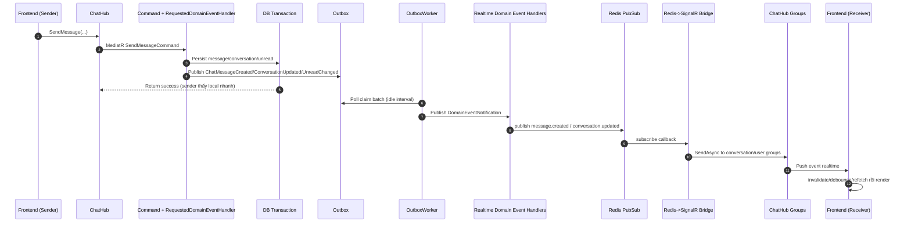
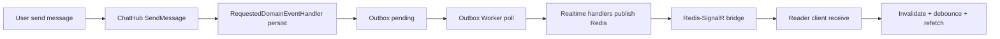
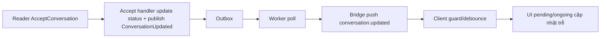
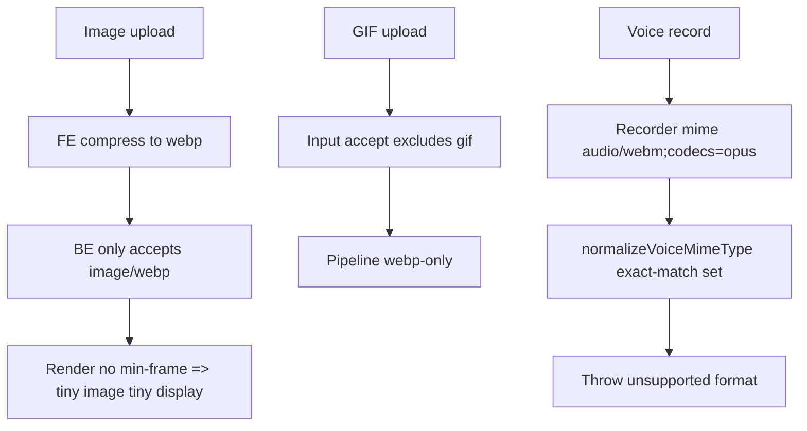

# Review Chi Tiết Luồng Chat Production - TarotNow (Realtime, Media, Approval)

**Ngày review:** 2026-05-01  
**Môi trường:** Production [tarotnow.xyz](https://www.tarotnow.xyz/vi)  
**Tài khoản test:** `Lucifer` (Admin/User side), `Test` (Tarot-reader)

## 1) Tóm tắt điều hành

- Vấn đề chậm realtime là **có thật** và mang tính kiến trúc: chat event đang đi qua **durable path (Outbox -> Worker -> Redis -> SignalR)** mặc định, không có fast-lane chuyên cho room message.
- Lỗi nghiệp vụ/UI đã tái hiện trực tiếp trên production:
  - `payment_accept` hiển thị **raw JSON** thay vì nội dung thân thiện.
  - Gửi voice báo: **"Định dạng âm thanh chưa được hỗ trợ."**
  - Ảnh nhỏ hiển thị rất bé do thiếu khung hiển thị tối thiểu.
  - GIF không được hỗ trợ end-to-end (FE accept/type + backend mime policy).
- Trải nghiệm "phải F5 mới thấy" đến từ tổ hợp:
  - outbox poll theo nhịp idle,
  - debounce + guard ở frontend,
  - chiến lược inbox/unread thiên về invalidate thay vì push-delta patch.

---

## 2) Kết quả runtime test trên production

## 2.1 Các ca đã chạy thành công

1. Text message hai chiều trong cùng room (`Lucifer <-> Test`) nhận được, nhưng độ trễ không ổn định theo thời điểm.
2. Reader tạo yêu cầu cộng tiền, User bấm đồng ý:
   - Luồng nghiệp vụ chạy được.
   - Tin nhắn phản hồi hiển thị raw JSON (bug UI nghiêm trọng).
3. Upload ảnh PNG nhỏ (`1x1`) thành công, nhưng hiển thị cực nhỏ (UX kém).
4. Ghi âm voice và gửi:
   - Tái hiện trực tiếp toast lỗi: **"Định dạng âm thanh chưa được hỗ trợ."**

## 2.2 Kết quả tái hiện lỗi cụ thể (đã quan sát trực tiếp)

| ID | Triệu chứng | Trạng thái |
|---|---|---|
| R-01 | Reader nhận chat chậm, có lúc cần refresh | Tái hiện gián tiếp qua kiến trúc + hành vi invalidate/guard |
| R-02 | Reader phê duyệt/pending cập nhật chậm | Có cơ sở code rõ ràng (debounce + stale + outbox path) |
| R-03 | Reader yêu cầu cộng tiền hiển thị chậm | Có cơ sở kiến trúc outbox + invalidate |
| R-04 | User đồng ý cộng tiền hiển thị ID/JSON | **Tái hiện trực tiếp** |
| R-05 | Ảnh nhỏ hiển thị bé | **Tái hiện trực tiếp** |
| R-06 | GIF không nhận | Có cơ sở code rõ ràng (không support) |
| R-07 | Voice lỗi định dạng | **Tái hiện trực tiếp** |

---

## 3) Luồng end-to-end hiện tại (thực tế đang chạy)

### Nhận xét chính

- Đường realtime của room message đang phụ thuộc outbox worker cadence.
- Sender có optimistic/local feedback, nhưng receiver phụ thuộc durable dispatch + client invalidation strategy.

---

## 4) Phân tích chi tiết theo lớp

## 4.1 Domain/Application (Rule 0 strict)

### Điểm đúng

- Command handlers mỏng, chỉ publish Requested Domain Event:
  - `/Users/lucifer/Desktop/TarotNowAI2/Backend/src/TarotNow.Application/Features/Chat/Commands/SendMessage/SendMessageCommandHandler.EventOnly.cs:20-25`
  - `/Users/lucifer/Desktop/TarotNowAI2/Backend/src/TarotNow.Application/Features/Chat/Commands/AcceptConversation/AcceptConversationCommandHandler.EventOnly.cs:20-25`

### Điểm vi phạm theo **Strict Literal Rule 0**

- RequestedDomainEventHandlers chứa orchestration nghiệp vụ + gọi trực tiếp repository/service:
  - `SendMessageCommandHandlerRequestedDomainEventHandler` inject nhiều repo/service và xử lý full flow:
    - `/Users/lucifer/Desktop/TarotNowAI2/Backend/src/TarotNow.Application/Features/Chat/Commands/SendMessage/SendMessageCommandHandler.cs:15-25,52-85`
    - `/Users/lucifer/Desktop/TarotNowAI2/Backend/src/TarotNow.Application/Features/Chat/Commands/SendMessage/SendMessageCommandHandler.PersistenceFlow.cs:14-31`
  - `AcceptConversationCommandHandlerRequestedDomainEventHandler` xử lý nghiệp vụ + repo trực tiếp:
    - `/Users/lucifer/Desktop/TarotNowAI2/Backend/src/TarotNow.Application/Features/Chat/Commands/AcceptConversation/AcceptConversationCommandHandler.cs:14-20,47-73`
  - `PresignConversationMedia...RequestedDomainEventHandler` xử lý validation + repo/upload service trực tiếp:
    - `/Users/lucifer/Desktop/TarotNowAI2/Backend/src/TarotNow.Application/Features/Chat/Commands/PresignConversationMedia/PresignConversationMediaCommand.cs:63-80,83-124`

**Kết luận strict mode:** kiến trúc hiện tại là event-first, nhưng chưa đạt strict tuyệt đối của Rule 0.

## 4.2 Infrastructure (Outbox/Redis/Bridge)

- Default outbox poll interval đang define 5 giây:
  - `/Users/lucifer/Desktop/TarotNowAI2/Backend/src/TarotNow.Application/Common/SystemConfigs/SystemConfigRegistry.Definitions.RuntimeAndMedia.cs:41`
- Worker loop:
  - Có fast loop 50ms **chỉ khi vừa xử lý được batch**.
  - Khi idle sẽ sleep theo poll interval.
  - `/Users/lucifer/Desktop/TarotNowAI2/Backend/src/TarotNow.Infrastructure/BackgroundJobs/Outbox/OutboxProcessorWorker.cs:34-59`
- Claim batch dùng `FOR UPDATE SKIP LOCKED`:
  - `/Users/lucifer/Desktop/TarotNowAI2/Backend/src/TarotNow.Infrastructure/BackgroundJobs/Outbox/OutboxBatchProcessor.cs:85-99`
- Retry/backoff/dead-letter có sẵn:
  - `/Users/lucifer/Desktop/TarotNowAI2/Backend/src/TarotNow.Infrastructure/BackgroundJobs/Outbox/OutboxBatchProcessor.Processing.cs:93-127`
- Atomic outbox yêu cầu active transaction:
  - `/Users/lucifer/Desktop/TarotNowAI2/Backend/src/TarotNow.Infrastructure/Services/MediatRDomainEventPublisher.cs:32-36`
- Redis realtime handlers đọc thêm repository trước khi publish (tăng cost mỗi event):
  - `/Users/lucifer/Desktop/TarotNowAI2/Backend/src/TarotNow.Application/DomainEvents/Handlers/RealtimeDomainEventHandlers.cs:78-95,127-141`
- Bridge Redis -> SignalR:
  - `/Users/lucifer/Desktop/TarotNowAI2/Backend/src/TarotNow.Api/Realtime/RedisRealtimeSignalRBridgeService.cs:54-57`
  - `/Users/lucifer/Desktop/TarotNowAI2/Backend/src/TarotNow.Api/Realtime/RedisRealtimeSignalRBridgeService.Forwarding.cs:9-42`

## 4.3 API/Hub

- `ChatHub.SendMessage` chỉ gọi MediatR, không tự broadcast message:
  - `/Users/lucifer/Desktop/TarotNowAI2/Backend/src/TarotNow.Api/Hubs/ChatHub.Messages.Send.cs:16-55`
- `JoinConversation` có validate access trước khi join group:
  - `/Users/lucifer/Desktop/TarotNowAI2/Backend/src/TarotNow.Api/Hubs/ChatHub.ConversationGroups.cs:12-33`
  - `/Users/lucifer/Desktop/TarotNowAI2/Backend/src/TarotNow.Api/Hubs/ChatHub.ConversationGroups.Helpers.cs:14-27`

## 4.4 Frontend (Realtime lifecycle)

- Realtime inbox/unread chủ yếu invalidate + debounce:
  - `/Users/lucifer/Desktop/TarotNowAI2/Frontend/src/shared/application/hooks/useChatRealtimeSync.ts:111-131,151-157`
- Guard thời gian khởi động có thể bỏ qua invalidate đầu phiên:
  - fallback config:
    - `/Users/lucifer/Desktop/TarotNowAI2/Frontend/src/shared/config/runtimePolicyFallbacks.ts:29-31`
  - appStart guard logic:
    - `/Users/lucifer/Desktop/TarotNowAI2/Frontend/src/shared/application/hooks/useChatRealtimeSync.ts:112-114,123-125`
- Chat room lifecycle có debounce và skip nhiều event type trước khi refetch conversation:
  - `/Users/lucifer/Desktop/TarotNowAI2/Frontend/src/features/chat/application/chat-connection/useChatSignalRLifecycle.ts:185-199`
- Inbox query stale 30s, không auto refetch on focus/reconnect/mount:
  - `/Users/lucifer/Desktop/TarotNowAI2/Frontend/src/features/chat/application/useChatInboxPage.ts:30-34`
- Global chat sync bị disable khi đang ở route `/chat/{id}`:
  - `/Users/lucifer/Desktop/TarotNowAI2/Frontend/src/shared/components/common/Navbar.tsx:47-51`

---

## 5) Root cause theo từng vấn đề bạn nêu

## 5.1 Gửi xong mất ~3s reader mới thấy / đôi lúc F5 mới thấy

### Root causes chính

1. **Outbox idle poll gating**: event có thể đợi đến chu kỳ poll tiếp theo.
   - `/Users/lucifer/Desktop/TarotNowAI2/Backend/src/TarotNow.Infrastructure/BackgroundJobs/Outbox/OutboxProcessorWorker.cs:52-59`
2. **Frontend debounce + guard** cho inbox/unread/conversation status.
   - `/Users/lucifer/Desktop/TarotNowAI2/Frontend/src/shared/application/hooks/useChatRealtimeSync.ts:117-130`
   - `/Users/lucifer/Desktop/TarotNowAI2/Frontend/src/features/chat/application/chat-connection/useChatSignalRLifecycle.ts:190-199`
3. **Invalidate-based sync** thay vì patch payload tức thời.

### Budget độ trễ ước lượng (current)

- `Outbox wait`: 0-5s (idle case)  
- `Dispatch + Redis + Bridge`: ~100-500ms  
- `FE debounce/refetch`: ~1-2s  
=> tổng cảm nhận dễ rơi vào 2.5-6s+, đúng phản ánh thực tế của bạn.

## 5.2 Reader vào phê duyệt/pending thấy lâu

- Accept/pending status đổi qua event chain giống trên.
- FE pending/inbox query stale và không auto refetch mạnh:
  - `/Users/lucifer/Desktop/TarotNowAI2/Frontend/src/features/chat/application/useChatInboxPage.ts:30-34`

## 5.3 Reader yêu cầu cộng tiền hiện chậm

- Payment offer/response cũng đi outbox + conversation.updated/unread_changed invalidate path.

## 5.4 User đồng ý cộng tiền nhưng hiển thị ID/JSON

### Reproduced bug

- UI room hiển thị raw JSON: `{"offerMessageId":"...","proposalId":"..."}`.

### Root cause

- Backend tạo content kiểu JSON string cho `payment_accept`:
  - `/Users/lucifer/Desktop/TarotNowAI2/Backend/src/TarotNow.Application/Features/Chat/Commands/RespondConversationAddMoney/RespondConversationAddMoneyCommandHandler.Workflow.Messages.cs:87-103`
  - `/Users/lucifer/Desktop/TarotNowAI2/Backend/src/TarotNow.Application/DomainEvents/Handlers/ConversationAddMoneyAcceptedSyncRequestedDomainEventHandler.cs:75-79`
- Frontend renderer chỉ custom cho `payment_offer`, không có bubble riêng cho `payment_accept/reject`:
  - `/Users/lucifer/Desktop/TarotNowAI2/Frontend/src/features/chat/presentation/chat-room/messages/ChatMessageListItem.tsx:27-50`
- FE chỉ parse JSON này cho map trạng thái offer, không render content thân thiện:
  - `/Users/lucifer/Desktop/TarotNowAI2/Frontend/src/features/chat/presentation/chat-room/utils.ts:6-17`

## 5.5 Ảnh nhỏ hiển thị bé, chưa fix kích thước

- Component ảnh không áp min frame/aspect cố định:
  - `/Users/lucifer/Desktop/TarotNowAI2/Frontend/src/features/chat/presentation/chat-room/messages/ChatImageMessage.tsx:18-30`

## 5.6 GIF chưa nhận

- Input `accept` không chứa gif:
  - `/Users/lucifer/Desktop/TarotNowAI2/Frontend/src/features/chat/presentation/chat-room/ChatComposerEditableFooter.tsx:69`
- FE ép ảnh upload thành `image/webp`:
  - `/Users/lucifer/Desktop/TarotNowAI2/Frontend/src/shared/media-upload/constants.ts:4,12-17`
- Backend image presign chỉ nhận `image/webp`:
  - `/Users/lucifer/Desktop/TarotNowAI2/Backend/src/TarotNow.Application/Features/Chat/Commands/PresignConversationMedia/PresignConversationMediaCommand.cs:150-153`
  - `/Users/lucifer/Desktop/TarotNowAI2/Backend/src/TarotNow.Application/Common/MediaUpload/MediaUploadConstants.cs:20-22`

## 5.7 Voice báo "Định dạng âm thanh chưa được hỗ trợ"

### Reproduced bug

- Đã tái hiện trực tiếp ở production khi ghi âm và gửi.

### Root cause kỹ thuật (rất rõ)

- Recorder ưu tiên MIME có codec param:
  - `/Users/lucifer/Desktop/TarotNowAI2/Frontend/src/features/chat/application/voiceRecorderHelpers.ts:10-13`
- Blob tạo ra dùng `recorder.mimeType` (thường là `audio/webm;codecs=opus`):
  - `/Users/lucifer/Desktop/TarotNowAI2/Frontend/src/features/chat/application/useVoiceRecorder.ts:56,87`
- Hàm normalize phía payload check exact match set mime **không strip `;codecs=...`**, nên throw unsupported:
  - `/Users/lucifer/Desktop/TarotNowAI2/Frontend/src/features/chat/presentation/chat-room/mediaPayload.ts:122-130`

---

## 6) Đánh giá tuân thủ Rule 0 & Global Antigravity Rules

| Hạng mục | Trạng thái | Nhận xét |
|---|---|---|
| Command handler mỏng, publish event | Đạt | Theo pattern event-only |
| Side-effects qua Event Handler | Đạt một phần | Đúng hướng nhưng requested handlers đang làm quá nhiều |
| Strict Literal Rule 0 (không gọi service/repo trong Application orchestration) | **Chưa đạt** | RequestedDomainEventHandler đang chứa logic + repo/service trực tiếp |
| Clean Architecture tổng thể | Trung bình-khá | Có boundary, nhưng orchestration dồn ở Application handlers |

---

## 7) Sơ đồ lỗi trọng điểm theo từng luồng nghiệp vụ bạn yêu cầu

## 7.1 User gửi -> Reader nhận

## 7.2 Reader phê duyệt pending

## 7.3 Reader yêu cầu cộng tiền -> User đồng ý

## 7.4 Media flow (image/gif/voice)

---

## 8) Danh sách issue theo mức độ

| Severity | Issue | Impact |
|---|---|---|
| Critical | Voice send fail do MIME normalize sai | Tính năng voice unusable |
| High | Payment accept/reject hiển thị raw JSON | Sai UX/hiểu nhầm nghiệp vụ tiền |
| High | Realtime latency phụ thuộc outbox idle poll | Chat không "instant" |
| High | Inbox/unread sync dùng invalidate + debounce + guard | Cảm giác trễ, dễ stale |
| Medium | GIF không support | Thiếu use-case media phổ biến |
| Medium | Ảnh nhỏ không có khung cố định | UX hiển thị không ổn định |
| Medium | Strict Rule 0 chưa đạt | Nợ kiến trúc dài hạn |

---

## 9) Checklist fix ưu tiên (không big-bang)

## P0 - Fix ngay (1-3 ngày)

1. Voice MIME normalization:
   - Strip parameter sau `;` trước khi check set MIME.
2. Renderer cho `payment_accept` / `payment_reject`:
   - Không fallback `ChatTextMessage` raw JSON.
3. Giảm delay hiện hữu:
   - Hạ `operational.outbox.poll_interval_seconds` + bỏ sleep cứng khi backlog > 0.
4. Ảnh:
   - Áp min frame + object-fit cho bubble image.

## P1 - Realtime trải nghiệm (1-2 tuần)

1. Push payload delta trực tiếp cho inbox/unread thay vì chỉ invalidate.
2. Trong room, tránh refetch debounce không cần thiết cho event có thể patch cục bộ.
3. Bổ sung fallback sync khi SignalR reconnect thất bại kéo dài (incremental pull theo cursor).

## P2 - Kiến trúc dài hạn (3-6+ tuần)

1. Tách hybrid chat realtime lane:
   - Fast lane cho `message.created` (instant push), durable lane vẫn giữ outbox.
2. Refactor requested handlers về đúng strict boundary Rule 0 theo phase.
3. Chuẩn hóa event envelope + idempotency + observability spans.

---

## 10) Metrics/SLO nên bật để xác nhận cải thiện

- `chat_room_delivery_latency_ms` (p50/p95)
- `chat_inbox_sync_latency_ms` (p50/p95)
- `outbox_chat_lag_ms`
- `chat_event_apply_error_rate`
- `signalr_reconnect_success_ratio`
- `chat_dedup_hit_ratio`
- `media_voice_send_failure_rate`

**Mục tiêu đề xuất:**
- Room message: p95 < 800ms
- Inbox/unread: p95 < 1.5s

---

## 11) Kết luận

- Chat hiện tại có nền tảng tốt (SignalR + Redis + Outbox), nhưng đang thiên về durability path nên realtime UX chưa đạt chuẩn sản phẩm chat chuyên nghiệp.
- Các lỗi media/payment bạn phản ánh là chính xác và đã có root cause code-level rõ ràng để fix dứt điểm.
- Nếu cần, bước tiếp theo mình có thể chuyển ngay sang patch P0 (voice + payment_accept renderer + image frame) rồi gửi PR nhỏ, tách khỏi refactor kiến trúc lớn để giảm rủi ro.
