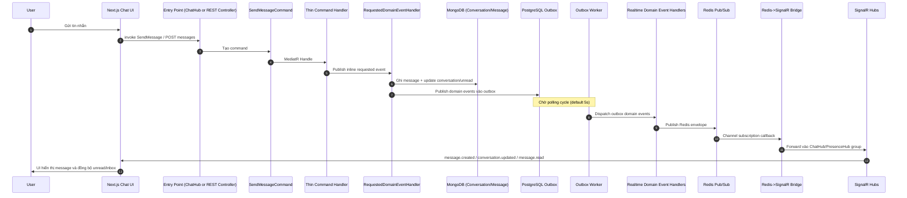
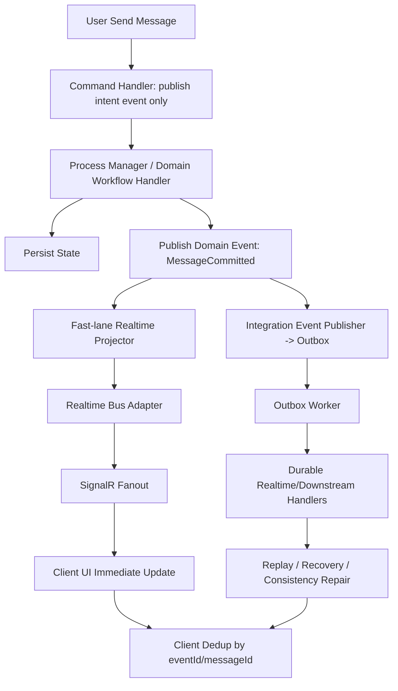

# Review Chi Tiết Tính Năng Tin Nhắn - TarotNow

**Ngày review:** 2026-04-30  
**Phạm vi:** Backend + Frontend luồng Messaging/Chat  
**Chế độ audit:** Strict Literal Rule 0 (theo yêu cầu)  
**Định hướng đề xuất:** Long-term architecture

## Tóm tắt điều hành

Hệ thống chat hiện tại **đã có SignalR**, nhưng chưa đạt cảm giác real-time do kiến trúc delivery đang phụ thuộc nặng vào **Outbox polling** trước khi phát sự kiện tới client. Với cấu hình mặc định hiện tại (`PollIntervalSeconds = 5`), độ trễ cảm nhận thường nằm trong khoảng 2.5-6+ giây, đặc biệt rõ với:

1. Tin nhắn của chính người gửi trong chat room (không append optimistic khi gửi qua SignalR thành công).
2. Inbox/unread badge (thêm debounce invalidation 1 giây, không có safety polling).

Ở góc độ tuân thủ, codebase đang theo convention “thin command handler + requested-domain-event-handler”. Convention này phù hợp với test kiến trúc hiện tại, nhưng theo **Strict Literal Rule 0** thì vẫn có nhiều vi phạm nghiêm trọng vì business logic và service/repository calls còn nằm trong Application layer.

---

## 1. Tổng quan luồng hiện tại (End-to-End Flow)

## 1.1 Sơ đồ luồng gửi tin nhắn hiện tại



## 1.2 Các bước chính và evidence theo code

| Bước | Mô tả | Evidence |
|---|---|---|
| 1 | Entry qua REST gửi tin nhắn | `Backend/src/TarotNow.Api/Controllers/ConversationController.Messages.cs:51-72` |
| 2 | Entry qua SignalR gửi tin nhắn | `Backend/src/TarotNow.Api/Hubs/ChatHub.Messages.Send.cs:15-48` |
| 3 | Thin command handler chỉ publish requested domain event | `Backend/src/TarotNow.Application/Features/Chat/Commands/SendMessage/SendMessageCommandHandler.EventOnly.cs:11-25` |
| 4 | Requested handler xử lý nghiệp vụ chính, ghi message/conversation, publish events | `Backend/src/TarotNow.Application/Features/Chat/Commands/SendMessage/SendMessageCommandHandler.cs:52-79`, `...PersistenceFlow.cs:14-144` |
| 5 | Domain events được ghi vào transactional outbox | `Backend/src/TarotNow.Infrastructure/Services/MediatRDomainEventPublisher.cs:29-60` |
| 6 | Outbox worker quét theo chu kỳ và luôn sleep sau mỗi vòng | `Backend/src/TarotNow.Infrastructure/BackgroundJobs/Outbox/OutboxProcessorWorker.cs:35-51` |
| 7 | Outbox dispatch qua MediatR notifications | `Backend/src/TarotNow.Infrastructure/BackgroundJobs/Outbox/OutboxBatchProcessor.Processing.cs:56-82` |
| 8 | Realtime handlers publish Redis channels | `Backend/src/TarotNow.Application/DomainEvents/Handlers/RealtimeDomainEventHandlers.cs:84-142`, `...ChatEphemeral.cs:34-86` |
| 9 | Bridge subscribe Redis channels rồi forward sang SignalR | `Backend/src/TarotNow.Api/Realtime/RedisRealtimeSignalRBridgeService.cs:54-109`, `...Forwarding.cs:9-122` |
| 10 | Frontend nhận `message.created` trong room hook | `Frontend/src/features/chat/application/chat-connection/useChatSignalRLifecycle.ts:146-162` |
| 11 | Frontend inbox/unread sync chủ yếu bằng query invalidation | `Frontend/src/shared/application/hooks/useChatRealtimeSync.ts:151-156`, `Frontend/src/shared/application/hooks/usePresenceConnection.registration.domainEvents.ts:70-77` |

## 1.3 Luồng inbox/unread hiện tại

```mermaid
flowchart LR
  A[Domain Event: ConversationUpdated/UnreadChanged] --> B[Outbox]
  B --> C[Outbox Worker Poll]
  C --> D[Realtime Handler Publish Redis]
  D --> E[Redis Bridge -> PresenceHub/ChatHub]
  E --> F[Frontend useChatRealtimeSync/usePresenceConnection]
  F --> G[invalidateQueries debounce 1s]
  G --> H[Refetch inbox/unread API]
  H --> I[UI cập nhật]
```



---

## 2. Phân tích chi tiết từng lớp theo Clean Architecture

## 2.1 Domain Layer

### 2.1.1 Domain events liên quan messaging

| Event | Ý nghĩa | Evidence |
|---|---|---|
| `ChatMessageCreatedDomainEvent` | Message mới được tạo | `Backend/src/TarotNow.Domain/Events/ChatMessageCreatedDomainEvent.cs:6-32` |
| `ConversationUpdatedDomainEvent` | Conversation đổi trạng thái/metadata | `Backend/src/TarotNow.Domain/Events/ConversationUpdatedDomainEvent.cs:4-25` |
| `UnreadCountChangedDomainEvent` | Unread của conversation thay đổi | `Backend/src/TarotNow.Domain/Events/UnreadCountChangedDomainEvent.cs:6-27` |
| `ChatMessageReadDomainEvent` | Participant mark read | `Backend/src/TarotNow.Domain/Events/ChatMessageReadDomainEvent.cs:6-22` |
| `ChatTypingChangedDomainEvent` | Typing started/stopped | `Backend/src/TarotNow.Domain/Events/ChatTypingChangedDomainEvent.cs:6-27` |
| `ChatModerationRequestedDomainEvent` | Trigger moderation pipeline | `Backend/src/TarotNow.Domain/Events/ChatModerationRequestedDomainEvent.cs:6-40` |
| `ChatOfferReceivedDomainEvent` | User gửi nội dung đầu tiên, tạo offer/freeze context | `Backend/src/TarotNow.Domain/Events/ChatOfferReceivedDomainEvent.cs:8-24` |

### 2.1.2 Nhận xét

1. Domain event set khá đầy đủ cho chat lifecycle.
2. Domain layer không chứa phụ thuộc framework trực tiếp trong các event class trên.

## 2.2 Application Layer

### 2.2.1 Commands/Queries chính của messaging

| Nhóm | Thành phần chính | Evidence |
|---|---|---|
| Command gửi message | `SendMessageCommand` + thin handler + requested handler | `...SendMessageCommandHandler.EventOnly.cs`, `...SendMessageCommandHandler.cs` |
| Command mark read | `MarkMessagesReadCommand` | `Backend/src/TarotNow.Application/Features/Chat/Commands/MarkMessagesRead/MarkMessagesReadCommand.cs` |
| Command typing | `PublishTypingStateCommand` | `Backend/src/TarotNow.Application/Features/Chat/Commands/PublishTypingState/PublishTypingStateCommand.cs` |
| Query list messages | `ListMessagesQueryHandler` | `Backend/src/TarotNow.Application/Features/Chat/Queries/ListMessages/ListMessagesQueryHandler.cs` |
| Query list inbox | `ListConversationsQueryHandler` | `Backend/src/TarotNow.Application/Features/Chat/Queries/ListConversations/ListConversationsQuery.cs:39-89` |
| Query unread total | `GetUnreadTotalQueryHandler` | `Backend/src/TarotNow.Application/Features/Chat/Queries/GetUnreadTotal/GetUnreadTotalQuery.cs:21-42` |

### 2.2.2 Rule 0 audit (Strict Literal)

Theo strict literal, các điểm sau là **vi phạm**:

| Severity | Vấn đề | Evidence |
|---|---|---|
| Critical | Business logic + repository/service calls nằm trong Application requested handlers | `...SendMessageCommandHandler.cs:15-49`, `...PersistenceFlow.cs:14-144`, `...MarkMessagesReadCommand.cs:26-103` |
| Critical | Application handlers thao tác trực tiếp finance/wallet/cache/upload | `...SendMessageCommandHandler.FirstMessageFreeze.cs:56-97`, `...FirstMessageFreeze.Workflow.cs:42-114`, `...PresignConversationMediaCommand.cs:63-123` |
| High | Command-to-command orchestration qua `_mediator.Send(...)` trong Application handlers | `...RequestConversationAddMoneyCommandHandler.Workflow.cs:51-57,89-103`, `...OpenConversationDisputeCommand.cs:83-88`, `...RespondConversationAddMoneyCommandHandler.Workflow.cs:56-63,94-101` |
| High | Event handlers trong Application vẫn gọi repository trực tiếp (realtime payload enrichment) | `RealtimeDomainEventHandlers.cs:56-96`, `RealtimeDomainEventHandlers.cs:105-142` |

### 2.2.3 Điểm phù hợp với convention hiện tại của repo

1. Command handlers mỏng, chỉ phụ thuộc `IInlineDomainEventDispatcher`.
- Evidence: `SendMessageCommandHandler.EventOnly.cs:13-25`, `MarkMessagesReadCommandHandler.EventOnly.cs:12-24`, `PublishTypingStateCommandHandler.EventOnly.cs:12-24`.

2. Có architecture tests bảo vệ pattern này.
- Evidence: `Backend/tests/TarotNow.ArchitectureTests/EventDrivenArchitectureRulesTests.cs:107-183`.

## 2.3 Infrastructure Layer

## 2.3.1 Outbox Pattern

### Cấu hình hiện tại

| Tham số | Giá trị | Evidence |
|---|---|---|
| `BatchSize` | 50 | `Backend/src/TarotNow.Api/appsettings.json:207-213` |
| `MaxRetryAttempts` | 12 | `Backend/src/TarotNow.Api/appsettings.json:207-213` |
| `MaxBackoffSeconds` | 300 | `Backend/src/TarotNow.Api/appsettings.json:207-213` |
| `PollIntervalSeconds` | 5 | `Backend/src/TarotNow.Api/appsettings.json:212`, `SystemConfigOptions.RuntimeAndMedia.cs:57-65` |
| `Parallelism` (default options) | 4 | `SystemConfigOptions.RuntimeAndMedia.cs:59-61` |

### Cơ chế chạy

1. Worker loop xử lý một batch rồi `Task.Delay(pollInterval)`.
- Evidence: `OutboxProcessorWorker.cs:39-50`.

2. Claim batch dùng `FOR UPDATE SKIP LOCKED`, status pending/failed/stale-processing.
- Evidence: `OutboxBatchProcessor.cs:84-99`.

3. Retry backoff theo `2^attempt`, clamp theo `MaxBackoff`.
- Evidence: `OutboxBatchProcessor.Processing.cs:95-127`.

4. Có dead-letter khi vượt max attempts.
- Evidence: `OutboxBatchProcessor.Processing.cs:97-113`.

### Vấn đề ảnh hưởng realtime

1. Poll cố định 5 giây tạo base latency lớn.
2. Worker sleep sau mỗi batch kể cả khi queue còn backlog.
3. Chat events dùng chung outbox với toàn hệ thống, dễ bị ảnh hưởng bởi burst từ domain khác.

## 2.3.2 Redis Pub/Sub

| Thành phần | Hiện trạng | Evidence |
|---|---|---|
| Publisher | `StackExchange.Redis` qua `RedisPublisher` | `Backend/src/TarotNow.Infrastructure/Messaging/Redis/RedisPublisher.cs:31-57` |
| Channels | `realtime:chat`, `realtime:wallet`, ... | `Backend/src/TarotNow.Application/Common/Realtime/RealtimeChannelNames.cs:11-37` |
| Event names | `message.created`, `conversation.updated`, ... | `Backend/src/TarotNow.Application/Common/Realtime/RealtimeEventNames.cs:21-47` |
| Fallback khi không Redis | `NoOpRedisPublisher` | `.../NoOpRedisPublisher.cs:8-12` |

## 2.3.3 Redis Bridge / Background Processor

1. Bridge subscribe nhiều channel và forward sang SignalR HubContext.
- Evidence: `RedisRealtimeSignalRBridgeService.cs:54-109`.

2. Callback Redis hiện chạy blocking bằng `.GetAwaiter().GetResult()`.
- Evidence: `RedisRealtimeBridgeSource.cs:72-74`.

```csharp
// RedisRealtimeBridgeSource.cs
onMessageAsync(redisChannel.ToString(), redisValue.ToString()).GetAwaiter().GetResult();
```

Đây là điểm rủi ro backpressure/latency khi traffic tăng.

## 2.3.4 Transaction + Outbox atomicity

1. Command pipeline có transaction behavior cho command.
- Evidence: `Backend/src/TarotNow.Application/Behaviors/CommandTransactionBehavior.cs:38-43`.

2. `IDomainEventPublisher` bắt buộc active PostgreSQL transaction.
- Evidence: `MediatRDomainEventPublisher.cs:32-36`.

3. Tuy nhiên dữ liệu chat chính được ghi ở Mongo (`MongoConversationRepository`, `MongoChatMessageRepository`).
- Evidence: `MongoConversationRepository.cs:29-33,132-139`, `MongoChatMessageRepository.cs:43-50`.

**Kết luận atomicity:** outbox atomic với write-model PostgreSQL, nhưng không atomic 2-phase với Mongo chat documents. Điều này tạo cửa sổ eventual consistency giữa “message đã lưu Mongo” và “event đã vào/ra outbox”.

## 2.3.5 Outbox observability hiện có

1. Có dashboard API vận hành outbox.
- Evidence: `Backend/src/TarotNow.Api/Controllers/AdminOutboxController.cs:32-41`.

2. Dashboard đã có chỉ số pending/failed/dead-letter/retry-age.
- Evidence: `OutboxMonitoringRepository.cs:25-50`.

## 2.4 API Layer

### 2.4.1 Controller

1. REST endpoint gửi message: `POST /api/v1/conversations/{id}/messages`.
- Evidence: `ConversationController.Messages.cs:51-72`.

2. REST list messages: `GET /api/v1/conversations/{id}/messages`.
- Evidence: `ConversationController.Messages.cs:20-42`.

3. REST unread total: `GET /api/v1/conversations/unread-total`.
- Evidence: `ConversationController.Inbox.cs:76-92`.

### 2.4.2 SignalR

1. Hub route chat: `/api/v1/chat`, presence: `/api/v1/presence`.
- Evidence: `ApiRoutes.cs:40`, `ApiApplicationBuilderExtensions.cs:222-223`.

2. Hub methods liên quan chat:
- `SendMessage`: `ChatHub.Messages.Send.cs:15-48`
- `MarkRead`: `ChatHub.Messages.Read.cs:13-60`
- `TypingStarted/TypingStopped`: `ChatHub.Typing.cs:12-49`
- `JoinConversation/LeaveConversation`: `ChatHub.ConversationGroups.cs:12-60`

3. Hubs không broadcast trực tiếp migrated events, forwarding qua bridge.
- Evidence: rule test `EventDrivenArchitectureRulesTests.cs:215-250`.

## 2.5 Frontend (Next.js)

## 2.5.1 Cách nhận tin nhắn hiện tại

1. Chat room kết nối SignalR riêng (`/api/v1/chat`) và nhận `message.created`, `message.read`, `typing.*`, `conversation.updated`.
- Evidence: `useChatSignalRLifecycle.ts:146-199`.

2. Nếu connect fail, fallback load REST history.
- Evidence: `useChatSignalRLifecycle.ts:235-250`.

3. Presence connection riêng (`/api/v1/presence`) để sync cross-feature.
- Evidence: `usePresenceConnection.ts:96-112`.

## 2.5.2 Custom hooks liên quan messaging

| Hook | Vai trò | Evidence |
|---|---|---|
| `useChatConnection` | Orchestrate chat room state + SignalR lifecycle | `Frontend/src/features/chat/application/useChatConnection.ts` |
| `useChatSignalRLifecycle` | Lifecycle kết nối room chat | `.../useChatSignalRLifecycle.ts` |
| `useChatSendActions` | Send message / media / mark read | `.../useChatSendActions.ts` |
| `useChatRealtimeSync` | Global inbox/unread invalidation qua `conversation.updated` | `Frontend/src/shared/application/hooks/useChatRealtimeSync.ts` |
| `usePresenceConnection` | Realtime presence + multi-domain invalidation | `.../usePresenceConnection.ts` |
| `useChatInboxPage` | Query inbox tab active/pending/completed | `.../useChatInboxPage.ts` |
| `useChatUnreadNotifications` | Query unread badge + browser notification | `.../useChatUnreadNotifications.ts` |

## 2.5.3 State management hiện tại

1. Server state: TanStack Query là chính.
- Evidence: `useChatInboxPage.ts:17-34`, `useChatUnreadNotifications.ts:65-86`.

2. Local auth/UI state: Zustand (`authStore`).
- Evidence: `useChatRealtimeSync.ts:6`, `usePresenceConnection.ts:6`, `Navbar.tsx:7,41`.

## 2.5.4 Điểm UX gây cảm giác chậm

1. Khi gửi qua SignalR thành công, FE **không append local ngay**.
- Evidence: `useChatSendActions.ts:80-84`.

```ts
await connectionRef.current.invoke('SendMessage', conversationId, normalized, type);
return true; // chưa append local message
```

2. Message chỉ xuất hiện khi server phát `message.created` sau outbox pipeline.

3. Inbox/unread invalidation có debounce 1s.
- Evidence: `useChatRealtimeSync.ts:117-130`, `usePresenceConnection.registration.chatInvalidation.ts:4,24-35`.

4. Inbox và unread query đều không polling, không refetch on focus/reconnect/mount.
- Evidence: `useChatInboxPage.ts:30-34`, `useChatUnreadNotifications.ts:81-86`.

---

## 3. Nguyên nhân gây không real-time

## 3.1 Bottleneck chính

| Mức độ | Bottleneck | Phân tích | Evidence |
|---|---|---|---|
| Critical | Outbox poll interval 5s | Đây là độ trễ nền cho mọi event chat qua outbox. | `OutboxProcessorWorker.cs:50`, `appsettings.json:212` |
| High | Worker sleep sau mỗi batch | Backlog tăng sẽ cộng dồn delay theo chu kỳ polling. | `OutboxProcessorWorker.cs:39-50` |
| High | Sender không optimistic append | Người gửi phải chờ roundtrip outbox+bridge mới thấy tin nhắn của chính mình. | `useChatSendActions.ts:80-84` |
| High | Redis callback blocking | `GetResult()` có thể làm nghẽn callback thread khi burst. | `RedisRealtimeBridgeSource.cs:72-74` |
| Medium | FE chỉ invalidation + debounce cho inbox/unread | Không push payload trực tiếp, và có thêm 1s delay debounce. | `useChatRealtimeSync.ts:151-156`, `...chatInvalidation.ts:24-35` |
| Medium | Không có safety polling | Nếu miss event, UI stale cho tới manual action hoặc invalidation khác. | `useChatInboxPage.ts:31-34`, `useChatUnreadNotifications.ts:83-86` |
| Medium | Realtime handlers đọc DB để dựng payload | Tăng thêm IO trước khi publish Redis. | `RealtimeDomainEventHandlers.cs:78-96,127-142` |

## 3.2 Budget độ trễ ước tính (hiện trạng)

### A. Tin nhắn hiển thị trong chat room (`message.created`)

1. Command + write DB: 50-300ms (phụ thuộc payload, wallet/freeze, Mongo).
2. Chờ outbox poll: 0-5000ms (trung bình ~2500ms).
3. Outbox dispatch + realtime handlers + Redis + bridge + SignalR: 50-500ms.

**Tổng ước tính:** ~100ms đến ~5800ms (điển hình 2.6-3.5s, có thể >6s khi backlog).

### B. Inbox/unread badge

1. A như trên đến khi nhận `conversation.updated`.
2. Debounce invalidation FE: +1000ms.
3. Refetch query/API roundtrip: +100-800ms.

**Tổng ước tính:** ~1.2s đến ~6.8s (điển hình 3.5-4.8s).

## 3.3 Edge cases làm delay nặng hơn

1. Outbox retry/dead-letter backlog do event handler lỗi.
- Ví dụ moderation handler ném exception khi moderation disabled, tạo retry queue.
- Evidence: `ChatModerationRequestedDomainEventHandler.cs:44-48`.

2. Redis unavailable ở non-prod khiến realtime path bị no-op.
- Evidence: `DependencyInjection.Cache.cs:65-75`, `NoOpRealtimeBridgeSource` wiring `ApiServiceCollectionExtensions.Platform.cs:58-68`.

3. Route-gated realtime + không polling làm stale state kéo dài khi user ở route không bật sync.
- Evidence: `normalizePathname.ts:60-76`, `Navbar.tsx:47-52`.

## 3.4 Tracing hiện tại chưa đủ để pin-point chat bottleneck

1. OpenTelemetry có ASP.NET + HttpClient instrumentation.
- Evidence: `ApiServiceCollectionExtensions.Observability.cs:36-56`.

2. Custom `ActivitySource` chủ yếu mới thấy ở auth namespace, chưa có chat/outbox end-to-end spans tương ứng.
- Evidence: `.AddSource("TarotNow.Auth")` tại `ApiServiceCollectionExtensions.Observability.cs:41`.

---

## 4. Đánh giá tuân thủ Rule 0 & Global Antigravity Rules

## 4.1 Kết quả theo Strict Literal Rule 0

| Rule | Trạng thái | Nhận xét |
|---|---|---|
| Business logic chỉ publish domain events | Fail | Requested handlers đang xử lý nghiệp vụ trực tiếp (đọc/ghi repo, wallet, finance, cache, upload). |
| Không gọi trực tiếp service/repository từ Application | Fail (rộng) | Nhiều command requested handlers inject và gọi trực tiếp repository/service. |
| Side-effects nằm trong event handlers | Partial | Nhiều side-effects realtime/moderation đã ở event handlers, nhưng core side-effects messaging vẫn nằm trong requested handlers. |
| Controller/Hub không thao tác side-effects business trực tiếp | Pass | Controller/Hub gọi MediatR, không broadcast migrated events trực tiếp. |

## 4.2 Bảng vi phạm theo mức độ

| Severity | Vi phạm | Evidence |
|---|---|---|
| Critical | `SendMessage` requested handler xử lý business flow lớn + repo/service calls | `SendMessageCommandHandler.cs:15-79`, `...PersistenceFlow.cs:14-144`, `...FirstMessageFreeze*.cs` |
| Critical | `MarkMessagesRead` requested handler cập nhật repo trực tiếp + publish events | `MarkMessagesReadCommand.cs:52-103` |
| High | Command orchestration chồng qua `_mediator.Send` trong Application handlers | `OpenConversationDisputeCommand.cs:83-88`, `RequestConversationAddMoney...Workflow.cs:51-57,89-103`, `RespondConversationAddMoney...Workflow.cs:56-63,94-101` |
| High | Presign media command gọi trực tiếp upload service hạ tầng trong Application | `PresignConversationMediaCommand.cs:63-123` |
| Medium | Realtime handlers còn đọc repository để build payload | `RealtimeDomainEventHandlers.cs:78-96,127-142` |

## 4.3 Điểm phù hợp với “convention nội bộ hiện tại”

1. Thin command handlers chỉ inject `IInlineDomainEventDispatcher`.
2. Realtime fan-out đi qua Redis bridge thay vì controller/hub broadcast thẳng.
3. Có idempotency layer cho event handlers (`OutboxHandlerIdempotencyService`).

Evidence: `IdempotentDomainEventNotificationHandler.cs:25-40`, `OutboxHandlerIdempotencyService.cs:22-53`.

---

## 5. Đề xuất tối ưu để đạt Real-time (Long-term Architecture)

## 5.1 Mục tiêu kiến trúc đích

1. Giữ **durable outbox** cho tính bền vững và replay.
2. Bổ sung **immediate push fast-lane** cho UX-critical chat events.
3. Vẫn đảm bảo boundary Clean Architecture và Rule 0 (strict) ở trạng thái target.
4. Chuẩn hóa telemetry end-to-end để đo độ trễ thật theo từng hop.

## 5.2 Sơ đồ kiến trúc đề xuất (Hybrid Durable + Immediate)



## 5.3 Thiết kế chi tiết theo pha (ưu tiên dài hạn)

### Phase 1: Chuẩn hóa contract + observability (nền tảng)

1. Chuẩn hóa realtime payload bắt buộc trường: `eventId`, `causationId`, `correlationId`, `occurredAtUtc`, `conversationId`, `messageId`.
2. Chuẩn hóa channel taxonomy tách `chat.fast` và `chat.durable` (hoặc equivalent stream topics).
3. Thêm tracing spans xuyên suốt send->deliver:
- `chat.command.accepted`
- `chat.persistence.completed`
- `chat.fastlane.published`
- `chat.outbox.enqueued`
- `chat.outbox.dispatched`
- `chat.client.received`

### Phase 2: Fast-lane immediate push cho UX-critical events

1. Cho `message.created`, `message.read`, `typing.*`, `conversation.updated` chạy thêm đường fast-lane ngay sau commit write chính.
2. Outbox vẫn giữ cho durability/recovery và downstream.
3. Client dedup sự kiện giữa fast-lane và durable-lane bằng `eventId` + `messageId`.

### Phase 3: Tái cấu trúc để tiệm cận Strict Literal Rule 0

1. Di chuyển nghiệp vụ nhiều side-effects khỏi Application handlers hiện tại sang process-manager/event-workflow boundary rõ hơn.
2. Application command giữ vai trò publish intent event; tránh repo/service calls trực tiếp theo strict mode.
3. Giảm command-to-command mediator chaining trong Application.

### Phase 4: Scale và resilience

1. Chuyển outbox processing sang cơ chế near-real-time trigger hoặc adaptive polling (không sleep cứng sau mỗi batch khi backlog > 0).
2. Ưu tiên queue/chat partition cho events UX-critical.
3. Tách callback Redis không blocking (`GetResult`) sang async pipeline có bounded channel.

## 5.4 Redis Pub/Sub + BFF pattern (khuyến nghị triển khai)

1. Dùng một tầng **Realtime BFF** chuyên trách fan-out tới web clients.
2. BFF subscribe Redis channels/streams chuyên cho chat (`chat.fast`, `chat.durable`) và map sang SignalR contract ổn định cho frontend.
3. BFF thực hiện dedup theo `eventId`, mapping version payload, và quản lý connection groups/user sessions.
4. Core API/Application không cần biết SignalR payload shape chi tiết, giúp giảm coupling và giảm rủi ro breaking change FE khi domain event tiến hóa.

## 5.5 Các cải tiến tạm thời (transitional, không phá kiến trúc)

1. Giảm `Outbox.PollIntervalSeconds` từ 5 xuống 1-2 trong giai đoạn chuyển tiếp.
2. Thêm optimistic append cho sender sau khi `invoke('SendMessage')` thành công, reconcile bằng `messageId` khi event về.
3. Thêm safety polling nhẹ cho inbox/unread (ví dụ 15-30s) khi realtime disconnect.

---

## 6. Checklist & Action Items

## 6.1 Critical issues cần fix ngay

1. Outbox polling 5s tạo base latency quá lớn cho chat realtime.
2. Sender không thấy tin nhắn ngay khi gửi SignalR thành công.
3. Redis bridge callback blocking bằng `GetResult()`.
4. Inbox/unread không có safety polling khi event miss.

## 6.2 Refactor/cải tiến nên làm

1. Chuẩn hóa event contract có correlation/idempotency đầy đủ.
2. Bổ sung fast-lane realtime projector + client dedup.
3. Tách rõ event processing boundary để tiến gần strict Rule 0.
4. Tối ưu outbox worker strategy: adaptive polling/backpressure-aware.
5. Bổ sung chat-specific tracing spans, dashboards và SLO.

## 6.3 Metrics cần đo sau tối ưu

| Metric | Mục tiêu gợi ý |
|---|---|
| `chat_message_e2e_latency_ms` (send -> message render room) | p50 < 300ms, p95 < 1200ms |
| `chat_inbox_sync_latency_ms` (send -> inbox/unread update) | p50 < 800ms, p95 < 2000ms |
| `outbox_oldest_pending_age_seconds` | p95 < 2s |
| `outbox_retry_overdue_count` | gần 0 ổn định |
| `outbox_dead_letter_rate` | ~0 cho chat events |
| `signalr_reconnect_success_ratio` | > 99% |
| `unread_drift_rate` (badge lệch so với server) | < 0.1% |

---

## Phụ lục A - Evidence Snippets

## A.1 Outbox loop sleep

```csharp
// Backend/src/TarotNow.Infrastructure/BackgroundJobs/Outbox/OutboxProcessorWorker.cs
while (stoppingToken.IsCancellationRequested == false)
{
    await ProcessBatchOnceAsync(stoppingToken);
    await Task.Delay(ResolvePollInterval(), stoppingToken);
}
```

## A.2 Sender path không optimistic append khi SignalR send success

```ts
// Frontend/src/features/chat/application/chat-connection/useChatSendActions.ts
await connectionRef.current.invoke('SendMessage', conversationId, normalized, type);
return true;
```

## A.3 Redis bridge callback đang blocking

```csharp
// Backend/src/TarotNow.Api/Realtime/RedisRealtimeBridgeSource.cs
onMessageAsync(redisChannel.ToString(), redisValue.ToString()).GetAwaiter().GetResult();
```

---

## Phụ lục B - Ghi chú quan trọng về compliance

1. Báo cáo này đánh giá theo **Strict Literal Rule 0** do bạn chọn.
2. Nếu đánh giá theo convention nội bộ hiện tại của repo, một số mục trên sẽ chuyển từ “vi phạm” sang “accepted trade-off”.
3. Để đạt strict mode tuyệt đối mà vẫn giữ Clean Architecture, cần một migration nhiều pha, tránh big-bang rewrite.
