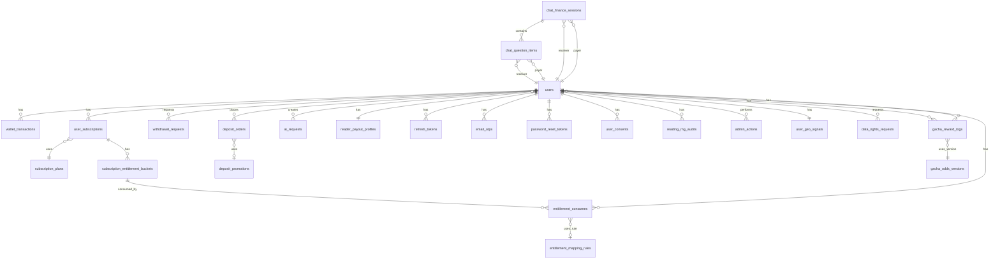

# TarotWeb – Tổng quan Database

## 1. Danh sách bảng PostgreSQL

| Bảng | Mô tả |
|------|-------|
| `users` | Tài khoản, số dư Gold/Diamond/frozen, role, streak, MFA, chargeback/dispute hold |
| `user_consents` | Lịch sử đồng ý pháp lý (TOS, Privacy, AI disclaimer) |
| `email_otps` | OTP xác thực email / reset mật khẩu |
| `password_reset_tokens` | Token reset mật khẩu |
| `refresh_tokens` | N2 fix: Refresh token chains cho JWT rotation + reuse detection (ARCH-4.1.5) |
| `deposit_promotions` | Khuyến mãi nạp |
| `deposit_orders` | Đơn nạp Diamond (có fx_rate_snapshot, refund tracking, idempotency) |
| `wallet_transactions` | Sổ cái Gold/Diamond (double-entry) |
| `chat_finance_sessions` | Phiên tài chính 1-1 conversation |
| `chat_question_items` | Escrow từng câu hỏi (main + add-question). Status: pending→accepted→released/refunded/disputed |
| `withdrawal_requests` | Yêu cầu rút tiền Reader |
| `reader_payout_profiles` | Thông tin ngân hàng Reader |
| `subscription_plans` | Gói thuê bao |
| `user_subscriptions` | Đăng ký gói (nhiều active) |
| `subscription_entitlement_buckets` | Quota entitlement theo ngày |
| `entitlement_consumes` | Nhật ký tiêu thụ entitlement |
| `ai_requests` | Trạng thái AI streaming (refund/idempotency) |
| `reading_rng_audits` | Audit RNG cho replay tranh chấp |
| `gacha_odds_versions` | Phiên bản tỷ lệ Gacha |
| `gacha_reward_logs` | Log phần thưởng Gacha |
| `user_exp_levels`, `card_exp_levels` | Bảng quy đổi EXP → level |
| `user_geo_signals` | Tín hiệu địa lý (geo compliance gating) |
| `system_configs` | Cấu hình runtime |
| `entitlement_mapping_rules` | Ánh xạ quyền lợi (BR-4.3.4) |
| `admin_actions` | Audit hành động admin |
| `data_rights_requests` | Yêu cầu quyền dữ liệu (OPS-4.13.7 – access/export/correction/deletion) |

> **Lưu ý (C4 fix):** `entitlement_consumes` có cột `mapping_rule_id` tham chiếu `entitlement_mapping_rules` để ghi nhận mapping rule đã dùng khi consume.

## 2. Danh sách collection MongoDB

| Collection | Mô tả |
|------------|-------|
| `cards_catalog` | 78 lá bài (Int32 _id 1–78) |
| `card_stories` | Ascension stories |
| `user_collections` | Túi bài, level, EXP |
| `reading_sessions` | Phiên xem bài + AI result |
| `reader_profiles` | Hồ sơ Reader |
| `reader_requests` | Đơn xin Reader |
| `conversations` | Header chat 1-1 |
| `chat_messages` | Tin nhắn |
| `reviews` | Đánh giá Reader |
| `reports` | Báo cáo |
| `referrals` | Mời bạn |
| `quests` | Định nghĩa quest |
| `quest_progress` | Tiến độ quest |
| `achievements` | Định nghĩa thành tựu |
| `user_achievements` | Thành tựu đã mở |
| `titles` | Định nghĩa danh hiệu |
| `user_titles` | Danh hiệu sở hữu |
| `reading_chains` | Friend chain |
| `events_config` | Cấu hình sự kiện |
| `notifications` | Thông báo (TTL 30d) |
| `daily_checkins` | Điểm danh |
| `ai_provider_logs` | Log AI đa provider (TTL 90d) – L4 fix: đổi tên từ grok_logs |
| `admin_logs` | Audit admin |
| `gacha_logs` | Log Gacha (TTL 180d) |
| `leaderboard_snapshots` | Snapshot BXH |
| `community_posts` | Bài cộng đồng (Phase 4) |
| `community_reactions` | Like/share (Phase 4) |
| `share_claims` | H5 fix: Claims chia sẻ + anti-abuse pipeline |

## 3. Sơ đồ quan hệ chính (Mermaid ER)

## 4. Tham chiếu chéo PostgreSQL ↔ MongoDB

| PostgreSQL | MongoDB |
|------------|---------|
| `chat_finance_sessions.conversation_ref` | `conversations._id` (ObjectId string) |
| `chat_question_items.conversation_ref` | `conversations._id` |
| `ai_requests.reading_session_ref` | `reading_sessions._id` |
| `reading_rng_audits.reading_session_ref` | `reading_sessions._id` |
| `users.active_title_ref` | `titles._id` |
| `conversations.finance_session_ref` | `chat_finance_sessions.id` (UUID string) |
| `wallet_transactions.reference_id` | ObjectId hoặc UUID string tùy `reference_source` |
| `share_claims.wallet_tx_ref` | `wallet_transactions.id` (UUID string) |

## 5. Invariants tài chính (bắt buộc)

- `users.diamond_balance >= 0`, `users.frozen_diamond_balance >= 0`
- `wallet_transactions.balance_after = balance_before + amount`, `amount != 0`
- Mọi freeze/release/refund escrow phải có `idempotency_key`
- Mọi transition finance: `SELECT ... FOR UPDATE` hoặc SERIALIZABLE
- **Mọi credit/debit PHẢI gọi `proc_wallet_credit` hoặc `proc_wallet_debit`** – không app code rời rạc
- **Mọi freeze/release/refund escrow PHẢI gọi `proc_wallet_freeze`, `proc_wallet_release`, `proc_wallet_refund`** – không update frozen_diamond_balance rời rạc
- Reconciliation job: so sánh `v_user_ledger_balance` với `users.<balance>`; alert nếu mismatch
- **C3 fix: `frozen_diamond_balance` không ghi ledger row khi release** – đây là ngoại lệ có chủ đích. Audit frozen balance qua `v_user_frozen_ledger_balance` view
